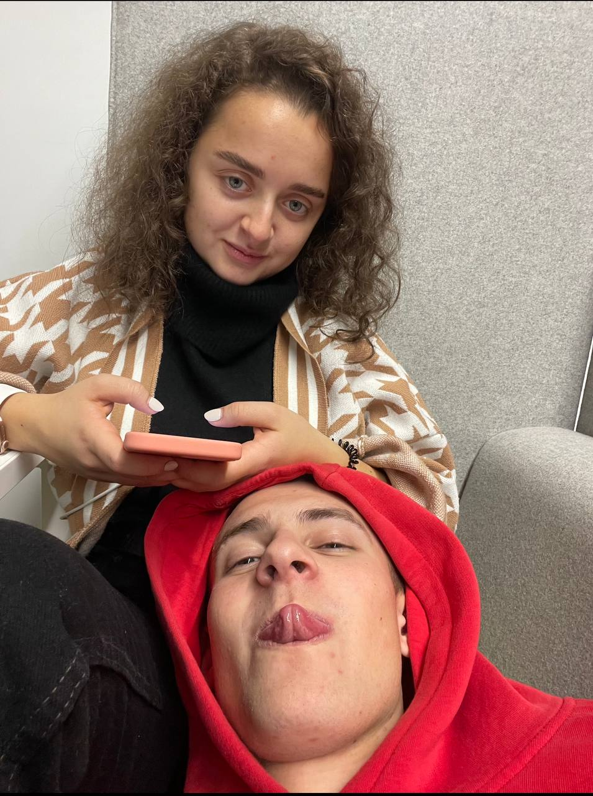
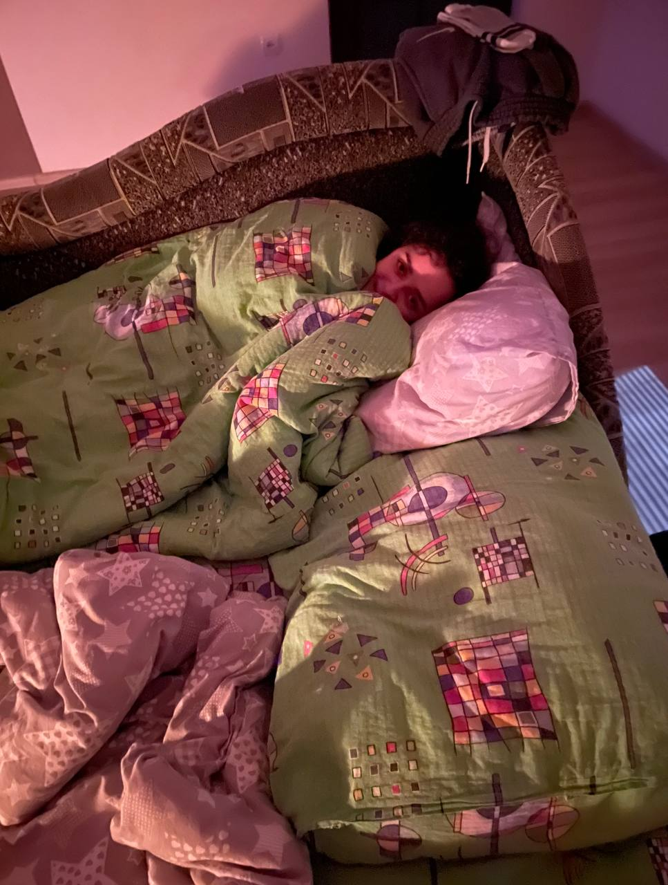
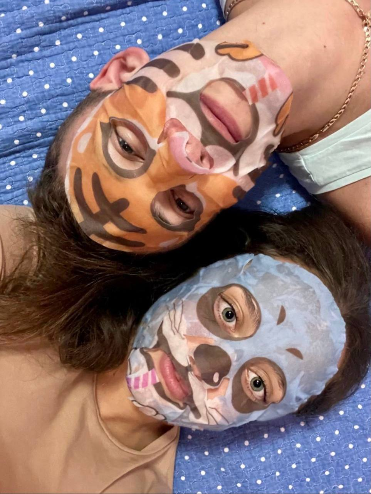
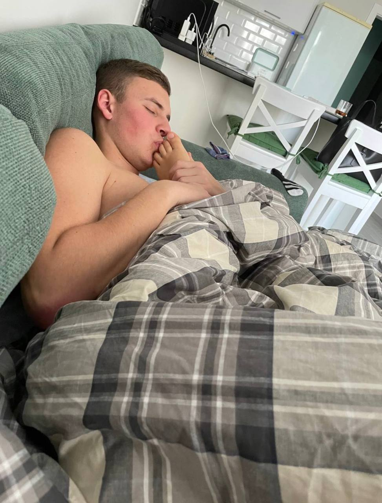

<!DOCTYPE html>
<html lang="en">

<head>
    <meta charset="UTF-8">
    <meta name="viewport" content="width=device-width, initial-scale=1.0">
    <title>Любимки</title>
</head>

<body>
    <h1>Котики муркотики</h1>
    
    
    
    
    

    
 <big>Котик мій солоденький я тебе дузє сильно любаю і доложу тобою як не знаю ким. Стволив цю століночку сьоб показати
        сьо я сьогодні вивцив і сьоб ти мною гордилась.</big>
    

    
<big>Хіхі малишка моя я так скучив за тобою і взе так зду ту зустліч сьо ти собі не уявляєш.
    </big>

    
<big>Хоцю тебе обіймати, цілувати і тіскати все твоє тіло.
        Ти реально моя така найдорожча дівчинка у світі, яку я так ціную і обожнюю.
        </big>

        <b><big>Малишка моя така смелдюца і така лідненька, я тебе дузєєєєє сильнезно люблююююююю і скуцаююююю котііік мій</big></b>
</body>

</html>
